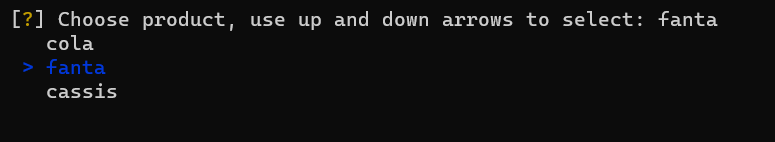
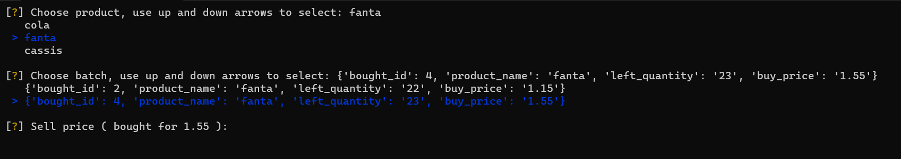

<header 
style="background:#6699cc;
color:whitesmoke;
border-left:20px solid lightgrey;
border-radius:0px 0px 50px 0px;
display:flex;
flex-flow:row nowrap;
align-items: center;
justify-content: space-evenly;
">
<div>
<h2 style="font-size:36px;padding:10px;">SuperPy</h2>
</div>
<div style="background:orange; height:100px;width:400px;height:100px;display:flex;flex-flow:column nowrap;justify-content:center; align-items:center;border-radius:0px 0px 50px">
<h2 style="font-style:italic">Three technical highlights</span></h2>
</div>
</header>

</br>

## **Number one**  
***The first technical highlight is the convert_date function***

**Problem** 

* For the program I wanted to use a single date format when storing products in the csv files. I chose **_dd-MM-yyyy_** as standard.   
* The problem is that date objects always start with year <yyyy> and are not as easy to manipulate as strings.  
* So for the csv files, I always want a date as string in the standard format. But for the date calculations, I need date objects.  
* Also, for convenience, I wanted the user to be able to enter dates with either year or day first.
  
</br>

**Here is where the function comes into play** 
* For the date calculations, I can simply give a date as string (from csv files for example) and get an date object back.
* For the csv files I can give the function date objects or strings, and it will return rightly formatted dates as strings.
* Also with this function in place, the user can choose to enter date either as <dd-MM-yyyy> or <yyyy-MM-dd> for convenience.  
 
<div style="background:rgba(102, 153, 204, 0.1);height:75px;display:flex;flex-flow:row nowrap;justify-content:flex-start; align-items:center;border-radius:0px 0px 50px;border-left:5px solid rgba(102, 153, 204, 0.3);">
<p style="margin-left:10px;">If user does not use <strong>dd-MM-yyyy</strong> or <strong>yyyy-MM-dd</strong> as format, the program will notify the user</p>
</div>

</br>

**How it works**:  </br>

* **Function takes two arguments**:
  *  `given_date` (string or object)
  *  `return_string` (boolean: default is True)   
* **First check**: is `given_date` **_string_** or **_object_**?
* **If object**: 
  * function will try to convert `given_date` to string with format **_dd-MM-yyyy_**
  * `return_string` is `True` and conversion to string succeeded : return `given_date` as **string** (dd-MM-yyyy).
  * `return_string` is `False` : return `given_string` as **object** (which it already was)
* **If string**: 
  * function splits `given_date` with delimiter **`-`** and first index of split is stored as `start_length`
  * `start_length` bigger than 2 means `given_date` starts with **_year_**, `date_format` is set to **_yyyy-MM-dd_** for conversion
  * `start_length` 2 or smaller means `given_date` starts with **_day_**, `date_format` is set to **_dd-MM-yyyy_** for conversion
  * Then, if `return_string` is `True`, it will return the `given_date` as **string**, but in the right format
  * If `return_string` is `False`, the function will return a date **object**

</br>

<div style="background:rgba(102, 153, 204, 0.1);height:75px;display:flex;flex-flow:row nowrap;justify-content:flex-start; align-items:center;border-radius:0px 0px 50px;border-left:5px solid rgba(102, 153, 204, 0.3);">
<p style="margin-left:10px;">The <strong>date_format</strong> is needed to avoid errors on conversion to object and to format date string in the right format</p>
</div>

</br>

_date_format variable_ :

```python
# f"%d-%m-%Y" equates to dd-MM-yyyy and f"%Y-%m-%d" equates to yyyy-MM-dd
date_format = (f"%d-%m-%Y" if start_length <= 2 else f"%Y-%m-%d")
```
</br>

_convert_date function_ :

```python
def convert_date(given_date, return_string: bool = True):
    date_type = type(given_date)
    if date_type == str:
        start_length = len(given_date.split("-")[0])
        date_format = (f"%d-%m-%Y" if start_length <= 2 else f"%Y-%m-%d")
        try:
            # convert to date object for when return_string is False (date objects do not keep the desired format)
            date_as_object = datetime.strptime(given_date, date_format).date()
        except ValueError as err:
            print(f"{given_date} is not a valid date")
            return print(f"PLease use valid date")
        if return_string:
            date_as_string = date_as_object.__format__(f"%d-%m-%Y")
            return date_as_string
        return date_as_object    
    else:
        # convert date object to string in desired format
        try:
            date_as_string = given_date.__format__(f"%d-%m-%Y")
        except ValueError as err:
            print(f"something went wrong trying to convert {given_date} to a string")
            return print(err)
        if return_string:
            return date_as_string
        return given_date
```

</br>

---

</br>

## **Number two**

**_The second technical highlight is the use of inquirer module and rich.prompt_**

**Problem**

* Selling products required manually input of a product's bought id
* Product profit required manually input of a product name
* Therefore user must first display a report to see product names or bought id ' s

</br>

**Solution**

Use of module **`inquirer`** and **`rich.prompt`**

* With the use of **_inquirer_** the user is now prompted with a list of products to choose from
* When selling products the user is also prompted to enter **sell price** and **sell quantity**
* When entering **sell price** user is also presented with the **buy_price** of the product
* When entering **sell quantity** user is also presented with the **maximum quantity** that can be sold.
* **_rich.prompt_** is used to ask for **_confirmation_** (where needed)

</br>

<div style="background:rgba(102, 153, 204, 0.1);height:75px;display:flex;flex-flow:row nowrap;justify-content:flex-start; align-items:center;border-radius:0px 0px 50px;border-left:5px solid rgba(102, 153, 204, 0.3);">
<p style="margin-left:10px;"><strong>rich.prompt</strong> is used to ask the user for confirmation because inquirer did not have that functionality out of the box</p>
</div>

</br>

**How it works**

For the list of products, the program gets the names from the product range file.  
This file contains all the different/unique products.  
User is prompted to select product   
The program gets the bought batches of the selected product.  
User can choose from which batch to sell the product

</br>

**This is how it looks like in the terminal or console** :

</br>

_Choose product_



</br>

_Choose batch_


</br>

_Choose sell price_



</br>

_Choose sell quantity_


</br>

_Confirm sell_


</br></br>

---

</br></br>

## **Number three**

**The third technical highlight is a simple one** :

</br>

<div style="background:rgba(102, 153, 204, 0.1);height:75px;display:flex;flex-flow:row nowrap;justify-content:flex-start; align-items:center;border-radius:0px 0px 50px;border-left:5px solid rgba(102, 153, 204, 0.3);">
<p style="margin-left:10px;">Let the user choose if the console screen needs to be cleared every time a command is used with SuperPy</p>
</div>

</br>

While it's convenient to to be able to scroll back (or up) through the console's history,   
sometimes it's also convenient to have a clutter free console.  
That's why I chose to implement a clear screen function.

**How it works**

* The program starts with an empty clear_screen csv file.   
* Using the command **_--toggle-cls_** will write string 'ON' to the csv file.  
* The program calls clear screen after every command and reads the csv file.
* If it reads **'ON'** the function tells the system to clear the console
* If it reads **'OFF'** or nothing, the program won't clear the screen
* Using **_--toggle-cls_** again, replaces **'ON'** with **'OFF'** in the csv file, etc...

</br>

<div style="background:rgba(102, 153, 204, 0.1);height:75px;display:flex;flex-flow:row nowrap;justify-content:flex-start; align-items:center;border-radius:0px 0px 50px;border-left:5px solid rgba(102, 153, 204, 0.3);">
<p style="margin-left:10px;">Because the program starts with an empty file, clear screen default setting will be <strong>OFF</strong></p>
</div>

</br>

Code:

```python
# get text from clear_screen.csv for use in function clear_screen()    
def get_clear_screen():
    cls = read_csv(cls_file)
    return cls


# function to replace text in clear_screen.csv

def toggle_clear_screen():
    toggle = get_clear_screen()
    if toggle != "ON" or toggle != "OFF":
        toggle_on = "ON"
        rewrite_csv(cls_file, [toggle_on])
    if toggle == "OFF":
        toggle_on = "ON"
        rewrite_csv(cls_file, [toggle_on])
    if toggle == "ON":
        toggle_off = "OFF"
        rewrite_csv(cls_file, [toggle_off])
    RichPrint(Text(f"\n You toggled clear screen to {get_clear_screen()} \n",style="bold italic white r"))


# clear screen based on text from clear_screen.csv
  
def clear_screen():
    clear_screen = get_clear_screen()
    if clear_screen == "ON":
        if name == "nt":
            system("cls")
        else:
            system("clear")