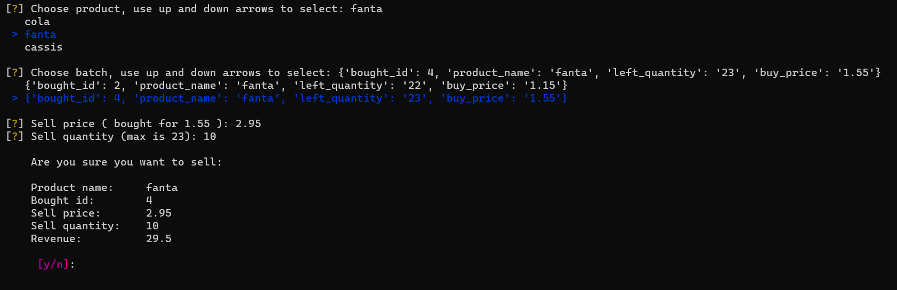

# **SuperPy**: **_Three technical highlights_**

## The first hightlight:

The first technical highlight is the convert_date function

Problem: 
>For the program I wanted to use a single date format when storing products in the csv files.
>I chose <dd-MM-yyyy> as standard.
>The problem is that date objects always start with year <yyyy> and are not as easy to manipulate as strings.
>So for the csv files, I always want a date as string in the standard format. 
>But for the date calculations, I need date objects. Here is where the function comes into play. 
>For the date calculations, I can simply give a date as string (from csv files for example) and get an date object back.
>For the csv files I can give the function date objects or strings, and it will return rightly formatted dates as strings.
>Also with this function in place, the user can choose to enter date either as <dd-MM-yyyy> or <yyyy-MM-dd> for convenience.
>If user doesn't use <dd-MM-yyyy> or <yyyy-MM-dd> as format, the function or program will tell the user.

This function takes two arguments: 
    given_date > this can be a string in format <dd-MM-yyyy> or <yyyy-MM-dd> or a date object
    return_string > a boolean with default value set to True

First check of the function is if the given_date is an date object or a string.

If given_date is an object, function will try to convert given_date to a string with format <dd-MM-yyyy> ('%d-%m-%Y').
When return_string is True and conversion to string succeeded, the function will return the date as a string in the right format.
When return_string is False, the date object is simply returned.

If the given_date is a string, the function does another check:

    First the string is splitted with delimiter '-', and the first part of the split is stored as start_length.
    2023-02-21 will be splitted into ['2023','02','21'] 
    first part of the split (index 0) will then be string the '2023' which has a length of 4
    With 21-02-2023 the start_length will become 2

    WIth the start_length the function can make the check for the right date_format:
    start_length 2 or smaller will set date_format to %d-%m-%Y
    start_length bigger than 2 will set date_format to %Y-%m-%d

    code: date_format = (f"%d-%m-%Y" if start_length <= 2 else f"%Y-%m-%d") 

    The date_format is needed to avoid errors and get the date as string in the right format

Then, if return_string is True, it will return the given_date as string, but in the right format
If return_string is False, the function will return a date object


def convert_date(given_date, return_string: bool = True):
    date_type = type(given_date)
    if date_type == str:
        start_length = len(given_date.split("-")[0])
        date_format = (f"%d-%m-%Y" if start_length <= 2 else f"%Y-%m-%d")
        try:
            # convert to date object for when return_string is False (date objects do not keep the desired format)
            date_as_object = datetime.strptime(given_date, date_format).date()
        except ValueError as err:
            print(f"{given_date} is not a valid date")
            return print(f"PLease use valid date")
        if return_string:
            date_as_string = date_as_object.__format__(f"%d-%m-%Y")
            return date_as_string
        return date_as_object    
    else:
        # convert date object to string in desired format
        try:
            date_as_string = given_date.__format__(f"%d-%m-%Y")
        except ValueError as err:
            print(f"something went wrong trying to convert {given_date} to a string")
            return print(err)
        if return_string:
            return date_as_string
        return given_date

## The second hightlight:

The second technical highlight is the use of inquirer module and rich.prompt

Problem:
>
>    Selling products required manually input of product names or bought_id's
     Product profit also required manually input of product_names
     To see id's or product_names, you first had to make the program display the reports in order to see the product names and id's
     With the use of inquirer the user is now prompted with a list of products to choose from
     With selling products the user is also prompted to enter sell price and sell quantity
     In those cases the user is also presented with the buy_price of the product and the maximum quantity that can be sold.
>

    How it works:
        For the list of products, the program gets the names from the product range file. This contains all the different/unique products
        With the (user) selected product name, the program gets the bought batches of that product name.
        User can choose from which batch to sell the product

        rich.prompt is used to ask the user for confirmation (inquirer did not have that functionality out of the box)

        

        

        

        

        


## The third hightlight

The third technical highlight is a simple one: 
    Let the user choose if the console screen needs to be cleared every time a command is used with superpy

While it's convenient to to be able to scroll back (or up) through the console's history, 
but sometimes it's also convenient to have a clutter free console.
That's why I chose to implement a clear screen function.
The program starts with an empty clear_screen csv file. The default for clear-screen is OFF (because file is empty).
When using the command --toggle-cls, a string 'ON' will be written to the csv file.
The program calss clear screen after every command and reads the csv file.
If it reads 'ON' the function tells the system to clear the console
If it reads 'OFF' or nothing, the program won't clear the screen
Using --toggle-cls again, replaces 'ON' with 'OFF' in the csv file, etc... 

```python
# get text from clear_screen.csv for use in function clear_screen()    
def get_clear_screen():
    cls = read_csv(cls_file)
    return cls


# function to replace text in clear_screen.csv

def toggle_clear_screen():
    toggle = get_clear_screen()
    if toggle != "ON" or toggle != "OFF":
        toggle_on = "ON"
        rewrite_csv(cls_file, [toggle_on])
    if toggle == "OFF":
        toggle_on = "ON"
        rewrite_csv(cls_file, [toggle_on])
    if toggle == "ON":
        toggle_off = "OFF"
        rewrite_csv(cls_file, [toggle_off])
    RichPrint(Text(f"\n You toggled clear screen to {get_clear_screen()} \n",style="bold italic white r"))


# clear screen based on text from clear_screen.csv
  
def clear_screen():
    clear_screen = get_clear_screen()
    if clear_screen == "ON":
        if name == "nt":
            system("cls")
        else:
            system("clear")